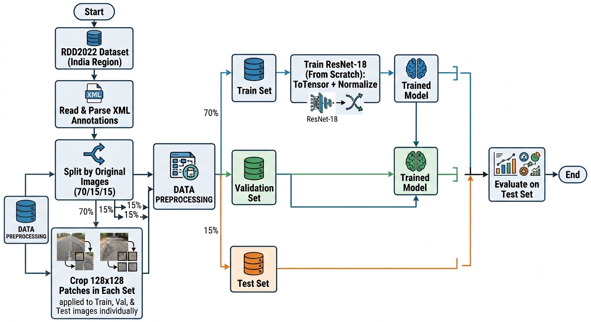
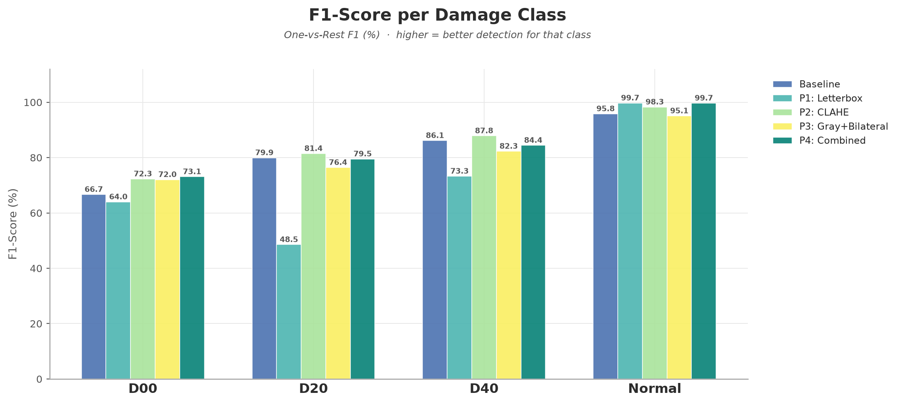
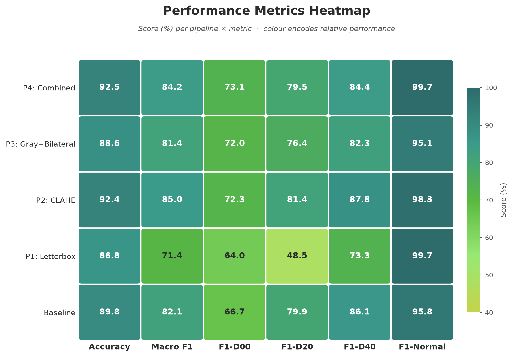
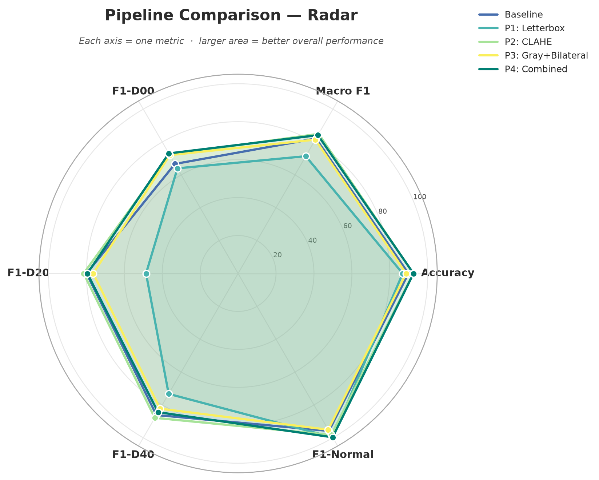
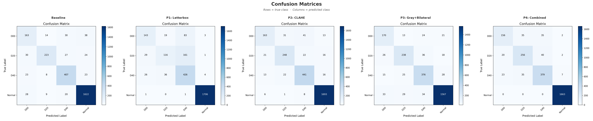
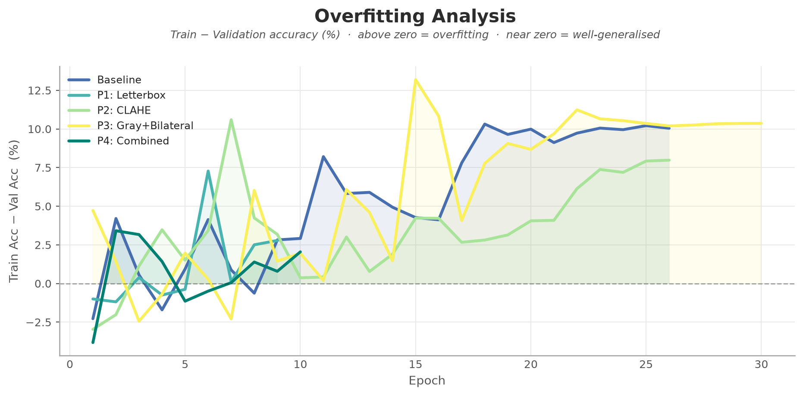
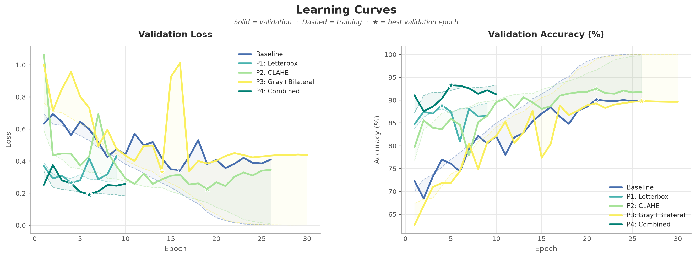

# Nghiên cứu Ảnh hưởng của Tiền xử lý Ảnh (Preprocessing) trong Phân loại Hư hỏng Mặt đường

Dự án này là đồ án thực hành cho **Module 1 (Computer Vision)** trong khóa học **AIO2026**. Dự án tập trung vào việc nghiên cứu, hiện thực hóa và so sánh định lượng tầm quan trọng của các kỹ thuật tiền xử lý ảnh (Image Preprocessing) khác nhau ảnh hưởng như thế nào đến độ chính xác và khả năng hội tụ của mô hình mạng học sâu (CNN - ResNet18) trên bài toán phân loại hư hỏng mặt đường.

---

## 🗺️ Quy trình thực hiện (Workflow)

Dự án được triển khai theo một quy trình khép kín từ khâu tải dữ liệu thô, tiền xử lý, phân chia dữ liệu cho tới huấn luyện và đánh giá:




---

## 📊 Bộ dữ liệu sử dụng (Dataset)

Dự án sử dụng bộ dữ liệu **RDD2022 (Road Damage Detection 2022)** - phân đoạn dữ liệu của quốc gia **Ấn Độ (India)**. 

### 1. Phân loại các nhãn hư hại (Classes)
Bộ dữ liệu nguyên bản là bài toán Object Detection (Xác định vật thể). Để chuyển đổi sang bài toán phân loại ảnh (Classification), nhóm đã trích xuất các vùng ảnh chứa vết nứt (patches) dựa trên các tọa độ khung bao (bounding box) tương ứng với 4 lớp chính:
*   **`D00` (Longitudinal Crack)**: Vết nứt dọc theo chiều dọc của làn đường.
*   **`D20` (Transverse Crack)**: Vết nứt ngang cắt ngang làn đường.
*   **`D40` (Alligator/Fatigue Crack)**: Vết nứt dạng lưới mạng nhện hoặc rạn chân chim (hư hại mức độ nặng).
*   **`Normal` (Normal pavement)**: Mặt đường bình thường, không bị hư hại.

### 2. Trích xuất lớp Normal & Tránh rò rỉ dữ liệu (Data Leakage)
*   **Patch Normal**: Được trích xuất ngẫu nhiên từ các vùng không chứa bất kỳ khung bao hư hỏng nào trong ảnh gốc với kích thước mặc định là $128 \times 128$ pixel. Số lượng patch Normal được giới hạn theo công thức `max(1, len(objects))` của từng ảnh để đảm bảo cân bằng dữ liệu tương đối.
*   **Phân chia dữ liệu**: Dữ liệu được chia theo tỷ lệ **70% Train / 15% Validation / 15% Test**. Quá trình chia tập được thực hiện **trước khi cắt patch** (chia ở cấp độ tệp tin ảnh gốc `.jpg` và nhãn `.xml`). Điều này đảm bảo các patch cắt ra từ cùng một bức ảnh gốc không nằm rải rác ở cả tập Train và Test, tránh hiện tượng rò rỉ dữ liệu (Data Leakage) nghiêm trọng.

### 3. Phân bổ dữ liệu tập kiểm thử (Test Set distribution)
Tổng số lượng mẫu trong tập kiểm thử (Test Set) là **2,689 mẫu**, phân bổ như sau:
*   **`D00`**: 245 mẫu (9.1%)
*   **`D20`**: 304 mẫu (11.3%)
*   **`D40`**: 461 mẫu (17.1%)
*   **`Normal`**: 1,679 mẫu (62.4%)

> [!IMPORTANT]
> Dữ liệu bị mất cân bằng nghiêm trọng (lớp Normal chiếm tới 62.4%, gấp gần 7 lần lớp D00). Do đó, **Macro F1-score** là thước đo chính dùng để đánh giá hiệu năng thay vì **Accuracy** thông thường.

---

## 🛠️ Các Kỹ thuật Tiền xử lý (Preprocessing Pipelines)

Nhóm đã thiết lập 5 cấu hình thử nghiệm khác nhau để cô lập và so sánh hiệu quả của từng phương pháp:

1.  **Baseline (Resize + Normalize)**: Ảnh màu RGB được resize trực tiếp về kích thước $224 \times 224$ (làm bóp méo tỷ lệ vết nứt nếu ảnh gốc không vuông) và chuẩn hóa theo giá trị trung bình của ImageNet.
2.  **Pipeline 1 (Letterbox)**: Thực hiện thay đổi kích thước ảnh giữ nguyên tỷ lệ khung hình (aspect ratio) bằng cách thêm viền đen (constant padding) xung quanh để đạt kích thước đích $224 \times 224$, tránh làm biến dạng đặc trưng hình học của vết nứt.
3.  **Pipeline 2 (CLAHE)**: Cân bằng biểu đồ cột giới hạn độ tương phản (Contrast Limited Adaptive Histogram Equalization) trên kênh độ sáng **L** của không gian màu **LAB**, sau đó chuyển ngược lại RGB. Giúp tăng độ tương phản rõ rệt của vết nứt khỏi bề mặt đường.
4.  **Pipeline 3 (Grayscale & Bilateral Filter)**: Chuyển đổi ảnh sang ảnh xám (loại bỏ màu sắc mặt đường gây nhiễu) và áp dụng lọc song phương (Bilateral Filter). Phương pháp này giúp khử nhiễu thô của bề mặt đường nhựa/bê tông nhưng vẫn bảo toàn tối đa các cạnh sắc nét của vết nứt.
5.  **Pipeline 4 (Combined)**: Kết hợp chuỗi xử lý: Chuyển ảnh xám $\rightarrow$ Áp dụng CLAHE $\rightarrow$ Lọc song phương $\rightarrow$ Letterbox Resize.

---

## 📈 Kết quả Thực nghiệm & Phân tích

Dưới đây là bảng tổng hợp kết quả đánh giá trên tập kiểm thử (Test Set) sau khi huấn luyện mô hình **ResNet-18** (30 epochs, Cosine Annealing Learning Rate, Early Stopping với patience = 5):

| Pipeline | Accuracy (%) | Macro F1 (%) | F1-D00 (%) | F1-D20 (%) | F1-D40 (%) | F1-Normal (%) |
| :--- | :---: | :---: | :---: | :---: | :---: | :---: |
| **Baseline** | 89.81 | 82.13 | 66.67 | 79.93 | 86.14 | 95.81 |
| **P1: Letterbox** | 86.79 | 71.37 | 63.98 | 48.54 | 73.26 | **99.71** |
| **P2: CLAHE** | 92.38 | **84.96** | 72.28 | **81.44** | **87.85** | 98.26 |
| **P3: Gray + Bilateral** | 88.62 | 81.44 | 72.03 | 76.40 | 82.28 | 95.06 |
| **P4: Combined** | **92.50** | 84.16 | **73.07** | 79.50 | 84.41 | 99.67 |

### 🔍 Nhận xét & Kết luận rút ra:
*   **CLAHE (P2) mang lại hiệu quả vượt trội nhất**: Đạt Macro F1 cao nhất (**84.96%**, tăng **+2.83%** so với Baseline). Việc tăng cường tương phản cục bộ giúp ResNet-18 dễ dàng trích xuất đặc trưng của các vết nứt mờ nhạt hoặc nứt nhỏ. Hiệu quả cải thiện đồng đều trên mọi lớp hư hại.
*   **Ảnh hưởng tiêu cực từ Letterbox (P1) đơn lẻ**: Việc padding viền đen làm giảm đáng kể hiệu năng phân loại vết nứt (F1-D20 sụt giảm nghiêm trọng từ 79.93% xuống 48.54%). Vùng viền đen chiếm tỉ lệ diện tích lớn làm mô hình bị bias cực mạnh vào lớp `Normal` (đạt F1-Normal 99.71% nhưng bỏ sót đa phần các nứt ngang D20).
*   **Lọc song phương (P3) cải thiện lớp khó nhất**: Lớp nứt dọc `D00` là lớp khó nhận biết nhất. Khi loại bỏ thông tin màu sắc và khử nhiễu giữ cạnh (Gray + Bilateral), F1-D00 tăng mạnh lên **72.03%** (+5.36%). Tuy nhiên, nó làm mờ một số chi tiết nứt lưới nhỏ của D40 dẫn đến F1-D40 giảm nhẹ.
*   **Sự kết hợp (P4) tối ưu hóa độ tin cậy**: Pipeline kết hợp đạt Accuracy cao nhất (**92.50%**) và F1-D00 cao nhất (**73.07%**). Đặc biệt, Recall lớp Normal đạt **100%** — nghĩa là mô hình không bị báo động giả (false alarm) bất kỳ đoạn đường bình thường nào sang bị nứt. Đây là yếu tố rất thực tiễn khi triển khai hệ thống thực tế.

### 📊 Các biểu đồ kết quả trực quan (Visual Evaluation Charts)

Dưới đây là các biểu đồ phân tích thực nghiệm thu được từ quá trình đánh giá và so sánh các pipeline:

| So sánh chỉ số F1-Score | Bản đồ nhiệt (Metrics Heatmap) |
| :---: | :---: |
|  |  |

| Biểu đồ Radar tổng hợp | Ma trận nhầm lẫn của tất cả Pipeline |
| :---: | :---: |
|  |  |

| Biểu đồ khoảng cách Overfit (Train vs Val) | Đường cong học tập (Learning Curves) |
| :---: | :---: |
|  |  |

---

## 📂 Tổng quan cấu trúc thư mục

```text
├── configs/            # Chứa các tệp cấu hình thực nghiệm (YAML)
│   ├── baseline.yaml            # Cấu hình Baseline (Resize + Normalize)
│   ├── pipeline1_letterbox.yaml # Cấu hình Pipeline 1 (Letterbox)
│   ├── pipeline2_clahe.yaml     # Cấu hình Pipeline 2 (CLAHE)
│   ├── pipeline3_grayscale_bilateral.yaml # Cấu hình Pipeline 3
│   └── pipeline4_combined.yaml  # Cấu hình Pipeline 4 (Combined)
├── data/               # Thư mục chứa dữ liệu (Bị bỏ qua bởi .gitignore)
│   ├── raw/            # Chứa dữ liệu gốc tải về (India/)
│   └── processed/      # Chứa các patch ảnh đã cắt và phân chia
├── notebooks/          # Jupyter Notebooks phân tích dữ liệu nhanh
├── outputs/            # Kết quả đầu ra sau huấn luyện
│   ├── baseline/       # Lịch sử train, model weights, confusion matrix của Baseline
│   ├── pipeline1_letterbox/
│   ├── pipeline2_clahe/
│   ├── pipeline3_tuned/
│   ├── pipeline4_tuned/
│   └── comparison/     # Các biểu đồ so sánh kết quả trực quan giữa các pipeline
├── src/                # Mã nguồn chính của dự án
│   ├── data/
│   │   ├── download_data.py    # Tải và giải nén dữ liệu tự động
│   │   ├── process_patches.py  # Cắt ảnh vết nứt từ file XML & phân chia dữ liệu
│   │   └── preprocess_dataset.py # Thực hiện tiền xử lý ảnh offline trước khi huấn luyện
│   ├── preprocessing/
│   │   └── transforms.py       # Hiện thực các hàm OpenCV xử lý ảnh
│   ├── models/
│   │   └── baseline_cnn.py     # Định nghĩa kiến trúc ResNet18
│   ├── training/
│   │   ├── dataset.py          # Lớp PyTorch Dataset tùy chỉnh để load ảnh
│   │   └── train.py            # Vòng lặp huấn luyện mô hình
│   └── evaluation/
│       └── evaluate.py         # Đánh giá trên tập test & lưu báo cáo
├── requirements.txt    # Các thư viện phụ thuộc của dự án
├── README.md           # Tệp giới thiệu dự án (Tệp này)
└── CONTRIBUTING.md     # Hướng dẫn đóng góp chi tiết cho dự án
```

---

## 🚀 Hướng dẫn nhanh chạy dự án

### Bước 1: Chuẩn bị môi trường
Cài đặt môi trường ảo Python và các thư viện cần thiết:
```bash
# Tạo môi trường ảo
python -m venv venv
# Kích hoạt môi trường ảo (Windows PowerShell)
.\venv\Scripts\Activate.ps1
# Cài đặt thư viện
pip install -r requirements.txt
```

### Bước 2: Tải và trích xuất dữ liệu
Tải tự động bộ dữ liệu RDD2022 India từ Google Drive của nhóm và cắt các patch ảnh:
```bash
# Tải dữ liệu thô về data/raw
python src/data/download_data.py

# Cắt các vùng hư hại và phân chia Train/Val/Test vào data/processed
python src/data/process_patches.py
```

### Bước 3: Tiền xử lý dữ liệu Offline (Bắt buộc cho từng Pipeline)
Trước khi chạy huấn luyện một pipeline nào đó, bạn cần chạy script tiền xử lý tương ứng để lưu các ảnh đã xử lý xuống ổ đĩa, giúp tiết kiệm tối đa tài nguyên tính toán khi train:
```bash
# Ví dụ chạy tiền xử lý offline cho Pipeline 2 (CLAHE)
python src/data/preprocess_dataset.py --config configs/pipeline2_clahe.yaml
```

### Bước 4: Huấn luyện mô hình (Train)
Chạy script huấn luyện tương ứng với file cấu hình đã tiền xử lý dữ liệu:
```bash
# Huấn luyện Pipeline 2 (CLAHE)
python src/training/train.py --config configs/pipeline2_clahe.yaml
```

### Bước 5: Đánh giá mô hình (Evaluate)
Đánh giá mô hình đã được huấn luyện trên tập kiểm thử (Test Set) để xem báo cáo kết quả và ma trận nhầm lẫn (Confusion Matrix):
```bash
# Đánh giá kết quả huấn luyện Pipeline 2
python src/evaluation/evaluate.py --config configs/pipeline2_clahe.yaml --model_path outputs/pipeline2_clahe/best_model.pth
```

